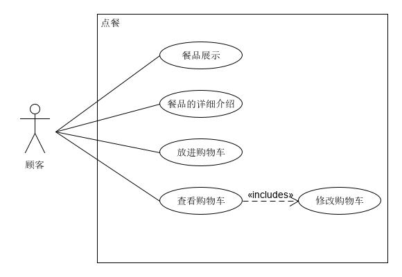
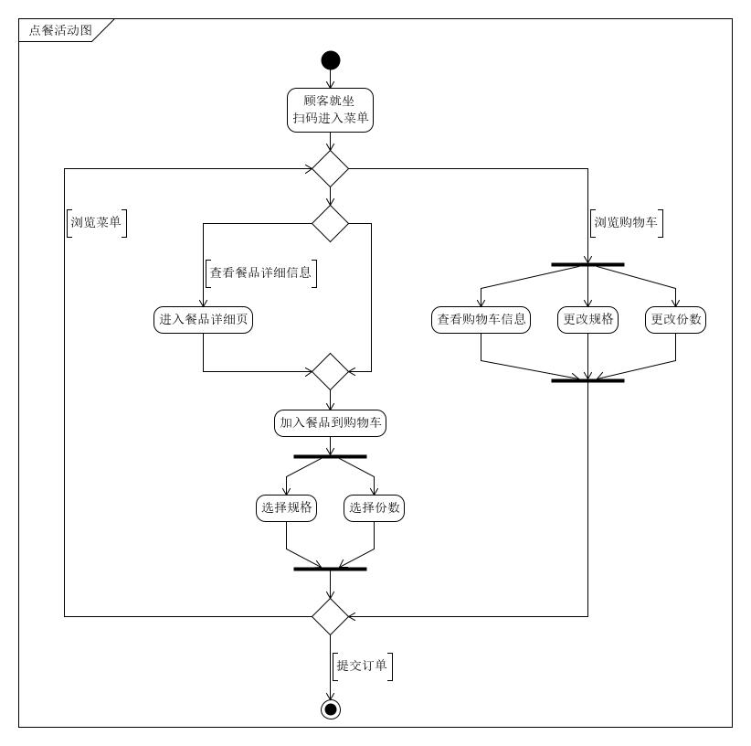

## 顾客点餐用例

| 版本 |   日期    | 描述 |  作者   |
| :--: | :-------: | :--: | :-----: |
| v1.0 | 2019-1-15 | 草案 | godsome |

### 用例图

### 范围

客户端

### 级别

用户目标

### 主要参与者

顾客

### 涉众及关注点

顾客：能够通过扫码进入点餐界面，希望便捷地看到店内的可点餐品，能够进一步查看餐品的详细信息和加入购物车，加入购物车时能够同时确定餐品规格及份数，能够看到实时累记的价格，在餐品加入购物车后，能够对餐品的规格进行更改，能够对份数进行增、删。

### 前置条件

顾客已就位并通过扫码进入点餐界面

### 后置条件

提交订单信息

### 主成功场景

1. 参与点餐的顾客就坐，并扫码
2. 在浏览界面查看餐品，可进一步查看餐品详细信息
3. 选择菜式，规格，份数，加入购物车，可实时查看消费金额
4. 可以通过购物车对菜式规格、份数进行更改
5. 提交订单

### 扩展

1. 顾客点餐时意外退出小程序
   - 系统保存当前点餐信息
   - 顾客重新进入时，可恢复之前信息
2. 顾客选择了库存不足的餐品
   - 告知该餐品无食材并致歉
3. 现金支付
   - 前台支付收取金额

### 活动图

