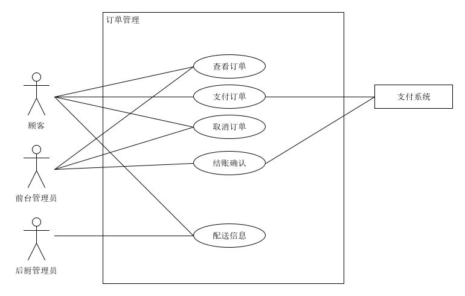
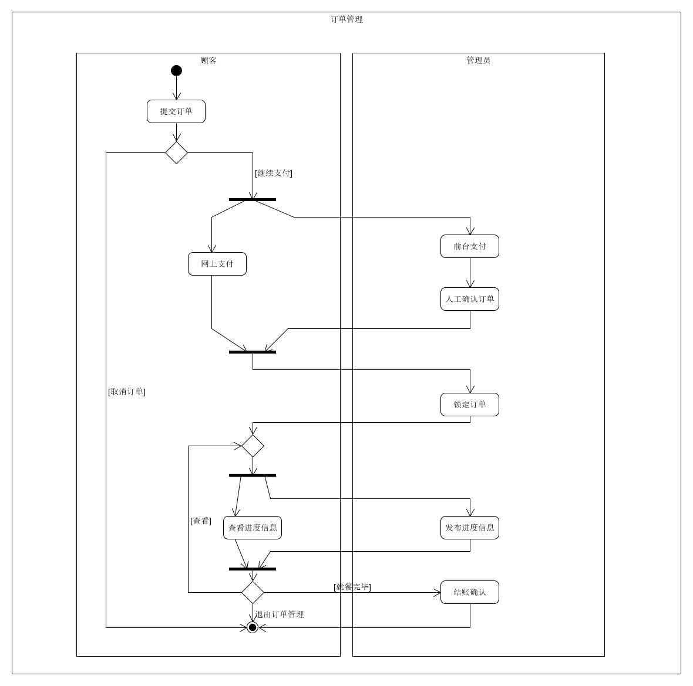

## 订单管理用例

| 版本 |   日期    | 描述 |  作者   |
| :--: | :-------: | :--: | :-----: |
| v1.0 | 2019-1-15 | 草案 | godsome |

### 用例图

### 范围

客户端，后台管理端

### 级别

子系统

### 主要参与者

顾客、管理员

### 涉众及关注点

顾客：能够查看订单信息，订单信息包括流水号，消费金额，消费日期，消费餐品信息；能够对未支付的订单进行支付或取消；能够查看某订单的进度信息，包括是否完成订单，已上餐品的信息

管理员：能够查看订单信息，编辑订单进度信息，对订单结账信息进行确认，确认包括顾客网上支付和前台支付形式

### 前置条件

顾客提交订单

### 后置条件

后台确认结账信息，重置餐桌就餐状态

### 主成功场景

1. 用户提交订单
2. 
   - 未支付，顾客可以取消订单，或通过网上支付、现金支付的方式确认订单；管理员对长时间未付款订单进行取消
   - 已支付，锁定订单
3. 管理员可查看未支付订单，若顾客现金支付，手动确认订单；对于已支付订单，开始进行配菜，并添加进度信息
4. 顾客可以查看订单配菜进度信息
5. 顾客用餐完毕后，后台进行结账确认，重置该餐位就餐信息

### 扩展

1. 顾客感觉配餐进度慢
   - 可以通过订单界面进行催促
2. 顾客不想网上支付
   - 提醒可前台现金支付

### 活动图

