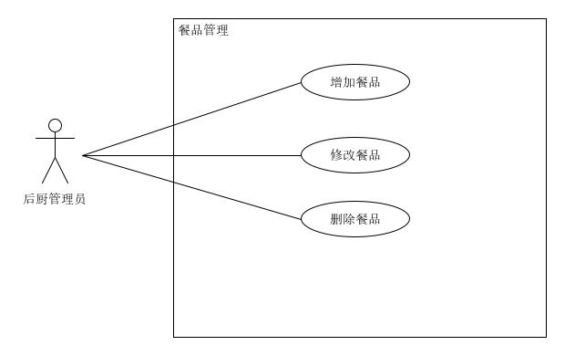
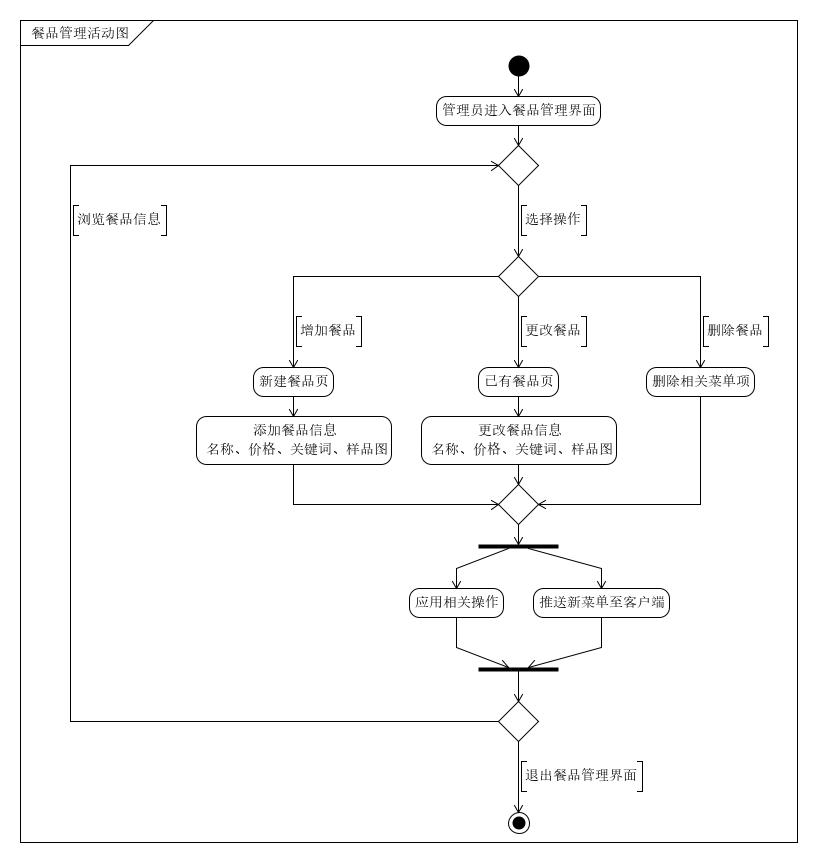

## 餐品管理用例

| 版本 |   日期    | 描述 |  作者   |
| :--: | :-------: | :--: | :-----: |
| v1.0 | 2019-1-15 | 草案 | godsome |

### 用例图

### 范围

后台管理端

### 级别

子系统

### 主要参与者

管理员

### 涉众及关注点

顾客：能够查看餐品信息，能够在点到无库存的菜式时得到提示

管理员：能够添加新的餐品，能够对已有的餐品信息进行更新，能够删除不再提供的餐品信息

### 前置条件

管理员进入餐品管理界面

### 后置条件

向客户端发送新的餐品信息

### 主成功场景

1. 管理员进入餐品管理界面
2. - 选择增加餐品，进入新的子界面，能够对餐品的名称，价格，关键词，详细信息，样品图进行编辑
   - 选择修改餐品，弹出与增加餐品相同的界面，不过此处只是对信息进行更新，不会产生新的条目
   - 选择删除餐品，弹出警告，由管理员确认是否删除
3. 增加、修改、删除餐品后，向客户端发送新的餐品列表

### 扩展

1. 餐厅可以自己选择向用户展示什么餐品，不需要过多的编辑
   - 维护一个总的餐品列表
   - 用户可以对这个列表进行增、删、查、改
   - 用户可以通过对列表项的选择来确定向客户端推送餐品信息
2. 餐厅希望对餐品进行更多样的管理
   - 能够对向客户展示的界面显示推荐餐品，热销餐品，餐品分类
   - 添加打折服务，提供满减服务

### 活动图

