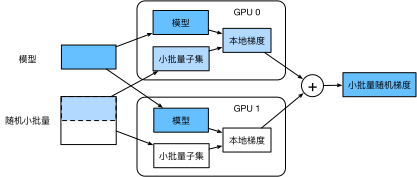

# 多GPU计算

本节中我们将展示如何使用多个GPU计算，例如使用多个GPU训练同一个模型。正如你期望的那样，运行本节中的程序需要至少两块GPU。事实上，一台机器上安装多块GPU很常见，这是因为主板上通常会有多个PCIe插槽。如果正确安装了NVIDIA驱动，我们可以通过`nvidia-smi`命令来查看当前计算机上的全部GPU。

```{.python .input  n=1}
!nvidia-smi
```

[“自动并行计算”](auto-parallelism.md)一节介绍过，大部分的运算可以使用所有的CPU的全部计算资源，或者单个GPU的全部计算资源。但如果使用多个GPU训练模型，我们仍然需要实现相应的算法。这些算法中最常用的叫做数据并行。


## 数据并行

数据并行目前是深度学习里使用最广泛的将模型训练任务划分到多个GPU的办法。回忆一下我们在[“小批量随机梯度下降”](../chapter_optimization/minibatch-sgd.md)一节中介绍的使用优化算法训练模型的过程。下面我们就以小批量随机梯度下降为例来介绍数据并行是如何工作的。

假设一台机器上有$k$个GPU。给定需要训练的模型，每个GPU将分别独立维护一份完整的模型参数。在模型训练的任意一次迭代中，给定一个随机小批量，我们将该批量中的样本划分成$k$份并分给每个GPU一份。然后，每个GPU将根据自己所分到的小批量子集和自己所维护的模型参数分别计算模型参数的本地梯度。接下来，我们把$k$个GPU上的本地梯度相加，便得到当前的小批量随机梯度。之后，每个GPU都使用这个小批量随机梯度分别更新自己所维护的那一份完整的模型参数。图8.1描绘了使用两个GPU的数据并行下的小批量随机梯度的计算。



为了从零开始实现多GPU训练中的数据并行，让我们先导入需要的包或模块。

```{.python .input  n=2}
import d2lzh as d2l
import mxnet as mx
from mxnet import autograd, nd
from mxnet.gluon import loss as gloss
import time
```

## 定义模型

我们使用[“卷积神经网络（LeNet）”](../chapter_convolutional-neural-networks/lenet.md)一节里介绍的LeNet来作为本节的样例模型。这里的模型实现部分只用到了NDArray。

```{.python .input  n=3}
# 初始化模型参数
scale = 0.01
W1 = nd.random.normal(scale=scale, shape=(20, 1, 3, 3))
b1 = nd.zeros(shape=20)
W2 = nd.random.normal(scale=scale, shape=(50, 20, 5, 5))
b2 = nd.zeros(shape=50)
W3 = nd.random.normal(scale=scale, shape=(800, 128))
b3 = nd.zeros(shape=128)
W4 = nd.random.normal(scale=scale, shape=(128, 10))
b4 = nd.zeros(shape=10)
params = [W1, b1, W2, b2, W3, b3, W4, b4]

# 定义模型
def lenet(X, params):
    h1_conv = nd.Convolution(data=X, weight=params[0], bias=params[1],
                             kernel=(3, 3), num_filter=20)
    h1_activation = nd.relu(h1_conv)
    h1 = nd.Pooling(data=h1_activation, pool_type='avg', kernel=(2, 2),
                    stride=(2, 2))
    h2_conv = nd.Convolution(data=h1, weight=params[2], bias=params[3],
                             kernel=(5, 5), num_filter=50)
    h2_activation = nd.relu(h2_conv)
    h2 = nd.Pooling(data=h2_activation, pool_type='avg', kernel=(2, 2),
                    stride=(2, 2))
    h2 = nd.flatten(h2)
    h3_linear = nd.dot(h2, params[4]) + params[5]
    h3 = nd.relu(h3_linear)
    y_hat = nd.dot(h3, params[6]) + params[7]
    return y_hat

# 交叉熵损失函数
loss = gloss.SoftmaxCrossEntropyLoss()
```

## 多GPU之间同步数据

我们需要实现一些多GPU之间同步数据的辅助函数。下面的`get_params`函数将模型参数复制到某个特定GPU并初始化梯度。

```{.python .input  n=4}
def get_params(params, ctx):
    new_params = [p.copyto(ctx) for p in params]
    for p in new_params:
        p.attach_grad()
    return new_params
```

尝试把模型参数`params`复制到`gpu(0)`上。

```{.python .input  n=5}
new_params = get_params(params, mx.gpu(0))
print('b1 weight:', new_params[1])
print('b1 grad:', new_params[1].grad)
```

给定分布在多个GPU之间的数据。以下的`allreduce`函数可以把各个GPU上的数据加起来，然后再广播到所有的GPU上。

```{.python .input  n=6}
def allreduce(data):
    for i in range(1, len(data)):
        data[0][:] += data[i].copyto(data[0].context)
    for i in range(1, len(data)):
        data[0].copyto(data[i])
```

简单测试一下`allreduce`函数。

```{.python .input  n=7}
data = [nd.ones((1, 2), ctx=mx.gpu(i)) * (i + 1) for i in range(2)]
print('before allreduce:', data)
allreduce(data)
print('after allreduce:', data)
```

给定一个批量的数据样本，以下的`split_and_load`函数可以划分它们并复制到各个GPU上。

```{.python .input  n=8}
def split_and_load(data, ctx):
    n, k = data.shape[0], len(ctx)
    m = n // k  # 简单起见，假设整除
    assert m * k == n, '# examples is not divided by # devices.'
    return [data[i * m: (i + 1) * m].as_in_context(ctx[i]) for i in range(k)]
```

让我们试着用`split_and_load`函数将6个数据样本平均分给2个GPU。

```{.python .input  n=9}
batch = nd.arange(24).reshape((6, 4))
ctx = [mx.gpu(0), mx.gpu(1)]
splitted = split_and_load(batch, ctx)
print('input: ', batch)
print('load into', ctx)
print('output:', splitted)
```

## 单个小批量上的多GPU训练

现在我们可以实现单个小批量上的多GPU训练了。它的实现主要依据本节介绍的数据并行方法。我们将使用刚刚定义的多GPU之间同步数据的辅助函数：`allreduce`和`split_and_load`。

```{.python .input  n=10}
def train_batch(X, y, gpu_params, ctx, lr):
    # 当ctx包含多块GPU及相应的显存时，将小批量数据样本划分并复制到各个显存上
    gpu_Xs, gpu_ys = split_and_load(X, ctx), split_and_load(y, ctx) 
    with autograd.record():  # 在各块GPU上分别计算损失
        ls = [loss(lenet(gpu_X, gpu_W), gpu_y)
              for gpu_X, gpu_y, gpu_W in zip(gpu_Xs, gpu_ys, gpu_params)]
    for l in ls:  # 在各块GPU上分别反向传播
        l.backward()
    # 把各块显卡的显存上的梯度加起来，然后广播到所有显存上
    for i in range(len(gpu_params[0])):
        allreduce([gpu_params[c][i].grad for c in range(len(ctx))])
    for param in gpu_params:  # 在各块显卡的显存上分别更新模型参数
        d2l.sgd(param, lr, X.shape[0])  # 这里使用了完整批量大小
```

## 训练函数

现在我们可以定义训练函数。这里的训练函数和之前章节里的训练函数稍有不同。例如，在这里我们需要依据数据并行将完整的模型参数复制到多个GPU上，并在每次迭代时对单个小批量上进行多GPU训练。

```{.python .input  n=11}
def train(num_gpus, batch_size, lr):
    train_iter, test_iter = d2l.load_data_fashion_mnist(batch_size)
    ctx = [mx.gpu(i) for i in range(num_gpus)]
    print('running on:', ctx)
    # 将模型参数复制到num_gpus块显卡的显存上
    gpu_params = [get_params(params, c) for c in ctx]
    for epoch in range(4):
        start = time.time()
        for X, y in train_iter:
            # 对单个小批量进行多GPU训练
            train_batch(X, y, gpu_params, ctx, lr)
            nd.waitall()
        train_time = time.time() - start

        def net(x):  # 在gpu(0)上验证模型
            return lenet(x, gpu_params[0])

        test_acc = d2l.evaluate_accuracy(test_iter, net, ctx[0])
        print('epoch %d, time %.1f sec, test acc %.2f'
              % (epoch + 1, train_time, test_acc))
```

## 多GPU训练实验

让我们先从单GPU训练开始。设批量大小为256，学习率为0.2。

```{.python .input  n=12}
train(num_gpus=1, batch_size=256, lr=0.2)
```

保持批量大小和学习率不变，将使用的GPU数改为2，可以看到测试精度的提升同上一个实验中的结果大体相当。由于额外的通讯开销，我们并没有看到训练时间的显著降低。

```{.python .input  n=13}
train(num_gpus=2, batch_size=256, lr=0.2)
```

## 小结

* 我们可以使用数据并行更充分地利用多个GPU的计算资源，实现多GPU训练模型。
* 给定超参数的情况下，改变GPU个数时模型的训练精度大体相当。

## 练习

* 在多GPU训练实验中，使用2个GPU训练并将`batch_size`翻倍至512，训练时间有何变化？如果希望测试精度与单GPU训练中的结果相当，学习率应如何调节？
* 将实验的模型预测部分改为用多GPU预测。


## 扫码直达[讨论区](https://discuss.gluon.ai/t/topic/1884)


